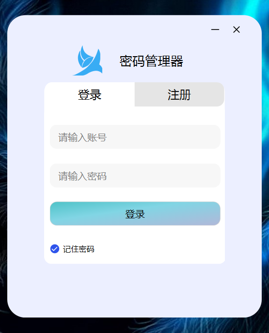
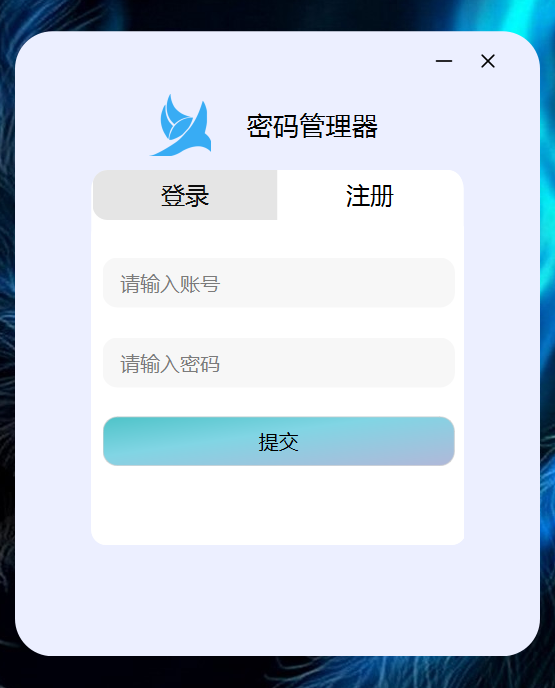
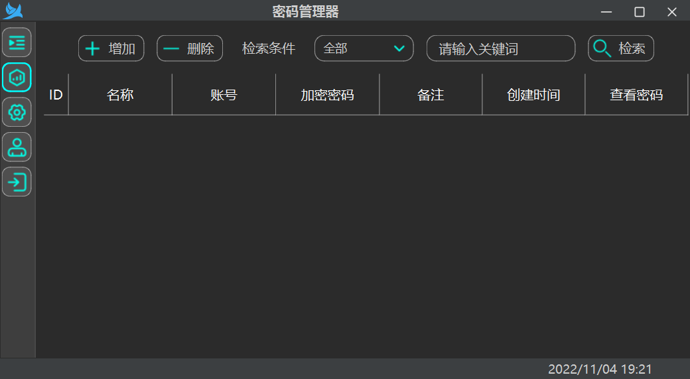
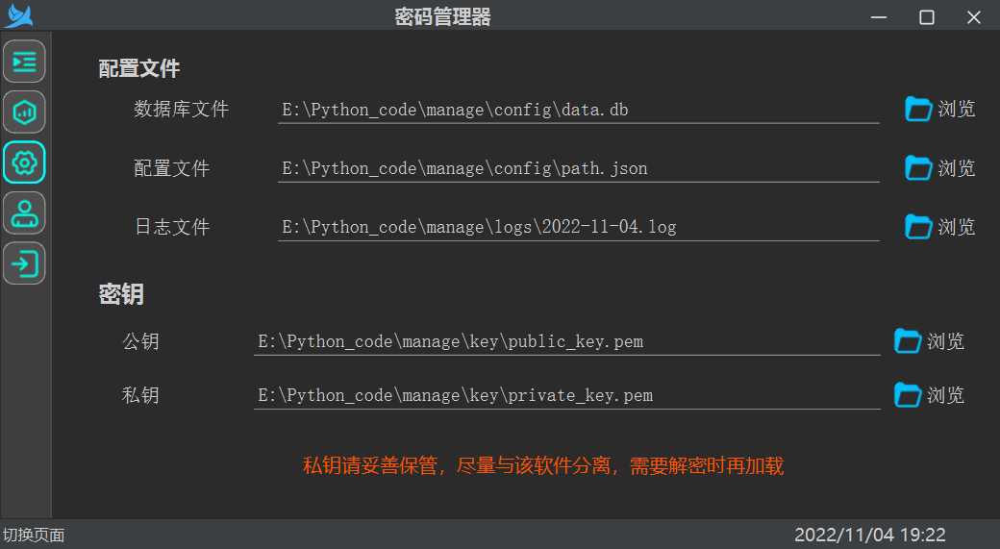
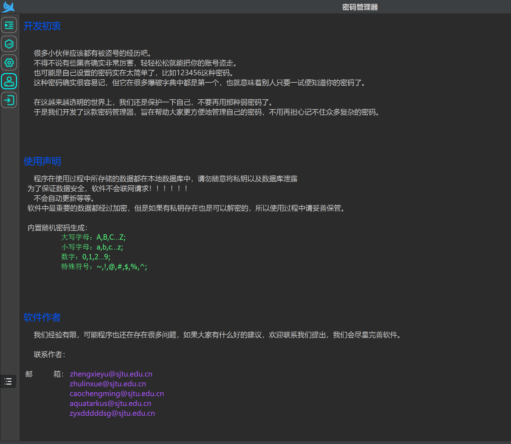

## 密码管理器 食用指北
***
### 用途
这是一个 _Python3_ 基于pyside6开发的一个密码管理器，用于加密存储我们在日常中的各种密码。解决使用复杂密码但是又怕记不住，简单密码有不安全的老大难问题。

**功能**
* 多用户使用
* 数据本地化管理
* 本地存储使用多种加密方式
***
实现功能
***
### 准备工作

您需要准备以下东西
#### 环境依赖
##### 执行 `pip install -r requirements.txt` 即可安装依赖

#### 源码运行

* main.py  运行主文件

* path.py     项目路径管理
* login.py    用户注册登录
* model.py    orm数据库
* Global/GlobalVariable.py  全局变量[除level外不建议修改， 一般运行请将其设置为INFO]

DEBUG 模式会输出敏感信息，非必要不要使用
### 最后

程序在使用过程中所存储的数据都在本地数据库中，请勿随意将私钥以及数据库泄露

为了保证数据安全，软件不会联网请求。

不会自动更新。

所有代码均已经开源，可以共同监督，一同开发。

软件中最重要的数据都经过加密，但是如果有私钥存在也是可以解密的，所以使用过程中请妥善保管。

内置随机密码生成：

	大写字母：A,B,C…Z;
	小写字母：a,b,c…z;
	数字：0,1,2…9;
	特殊符号：~,!,@,#,$,%,^;

### 运行截图

`登录`

  

`注册`

`主界面`

  

`设置界面`

 

`关于界面`

 

### 更新管理
#### 2024/3/27
* 实现基础功能模块
* 修复人脸识别模型训练bug
* 增加密码强度审计功能
* 增加人脸验证功能

#### 2022/4/1
* 更新人脸验证
* 增加自动保存失败登录人脸图像

#### 2024/4/6
* 整合模块功能
* 增加密码填充模块与密码复制模块

### 开发者邮箱：
* zhengxieyu@sjtu.edu.cn
* zyxdddddsg@sjtu.edu.cn
* aquatarkus@sjtu.edu.cn
* caochengming@sjtu.edu.cn
* zhulinxue@sjtu.edu.cn

### 致谢
* [wmx-github](https://github.com/wmx-github) 样式表与逻辑分离，样式表属性bug，查看密码
* [duckweed](https://github.com/valley-owner/pwdManage) demo实现，基础模板提供，基础功能模块